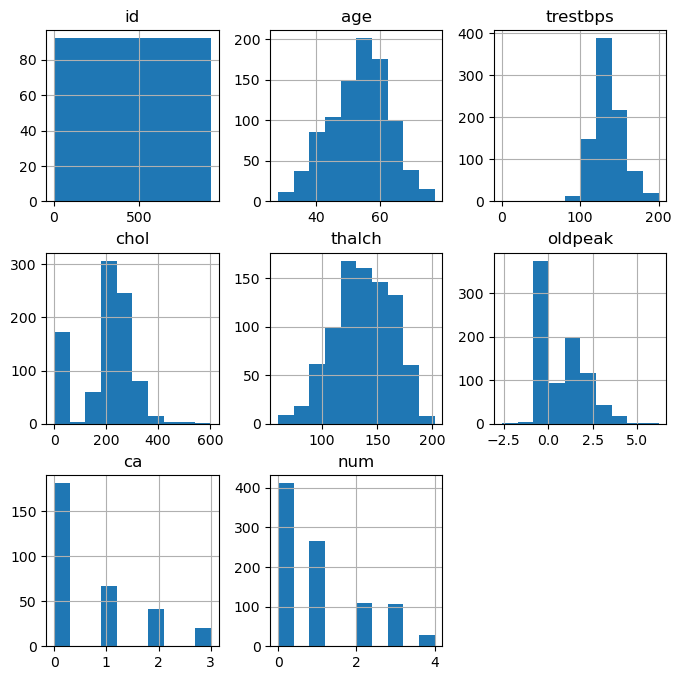
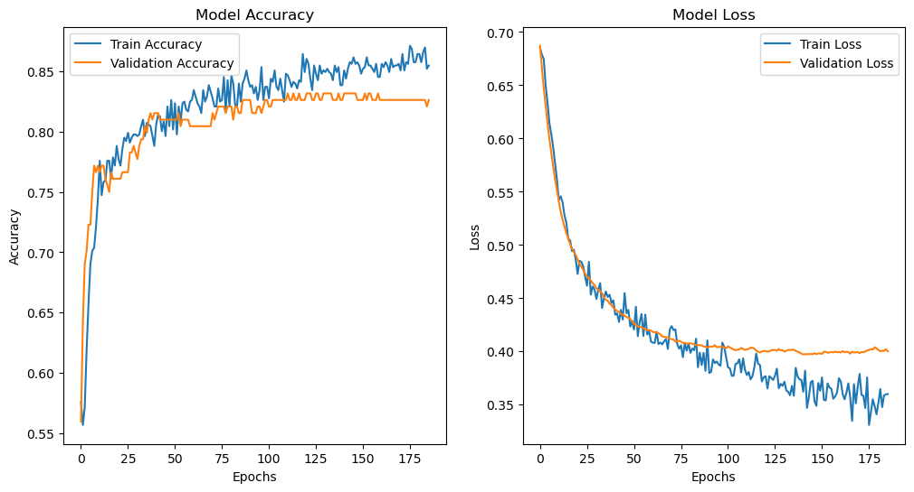
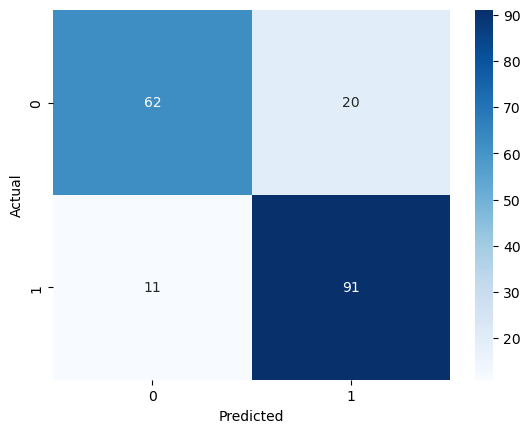
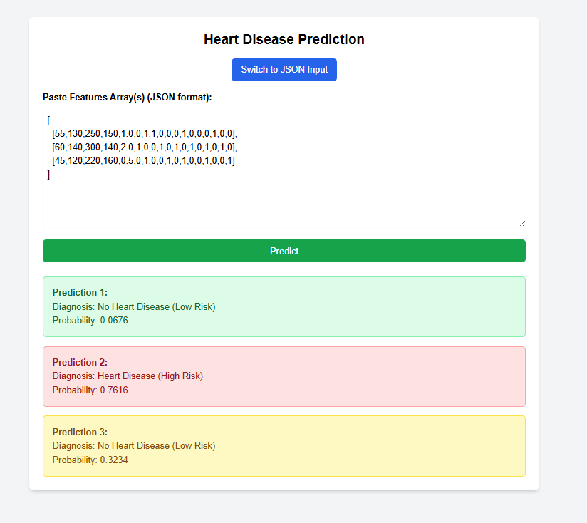

# Heart Disease Prediction System

## Overview

This project is a comprehensive AI-based system for predicting heart disease using machine learning techniques. It leverages a dataset of medical attributes to train a deep learning model that classifies whether a patient is at risk of heart disease. The system includes data preprocessing, handling class imbalance with oversampling, model training using Keras, a Flask-based API for predictions, and a simple HTML frontend for user input.

The project meets the requirements of building a diagnostic model, developing an API, and analyzing medical data. It uses Python with libraries like scikit-learn, TensorFlow/Keras, Pandas, NumPy, Matplotlib, Seaborn, and Flask.

Key features:
- Data cleaning and exploratory analysis.
- Oversampling to handle imbalanced classes (using SMOTE and RandomOverSampler).
- Deep learning model for binary classification (heart disease presence).
- RESTful API for single or batch predictions.
- Basic web interface for inputting patient data.

Dataset: Sourced from [Kaggle Heart Disease Data](https://www.kaggle.com/datasets/redwankarimsony/heart-disease-data), containing features like age, sex, chest pain type, blood pressure, cholesterol, etc.

## Features

- **Data Preparation**: Cleaning, handling missing values, encoding categorical variables, and scaling numerical features.
- **Exploratory Data Analysis (EDA)**: Visualizations for distributions, correlations, and feature importance.
- **Class Imbalance Handling**: Oversampling techniques to balance the dataset.
- **Model Training**: Keras-based neural network with dropout for regularization.
- **API**: Flask server for deploying the model, supporting JSON inputs for predictions.
- **Frontend**: HTML form for user-friendly input and prediction display.
- **Evaluation**: Accuracy, loss plots, confusion matrix, and feature importance.

## Installation

1. Clone the repository:
   ```
   git clone https://github.com/mustafataha5/heart-disease-prediction.git
   cd heart-disease-prediction
   ```

2. Create a virtual environment (recommended):
   ```
   python -m venv venv
   source venv/bin/activate  # On Windows: venv\Scripts\activate
   ```

3. Install dependencies:
   ```
   pip install -r requirements.txt
   ```
   (If `requirements.txt` is not present, install manually: `pip install pandas numpy scikit-learn tensorflow keras imbalanced-learn flask matplotlib seaborn`)

4. Download or ensure the following files are present:
   - `heart_disease_uci.csv` (dataset)
   - `cleaned_heart_disease_data.csv` (generated during data prep)
   - `heart_disease_model.keras` (trained model)
   - `scaler.pkl` (scaler for feature normalization)

## Usage

### 1. Data Preparation and EDA
Run the Jupyter notebooks:
- `Prepare_Data.ipynb`: Loads data, cleans it, performs EDA, and saves `cleaned_heart_disease_data.csv`.
- `Data_oversample.ipynb`: Applies SMOTE and RandomOverSampler to balance classes.

### 2. Model Training
Run `traing.ipynb` (note: rename to `training.ipynb` if needed):
- Loads cleaned data.
- Trains a Keras model.
- Saves the model as `heart_disease_model.keras`.
- Generates plots for accuracy/loss and confusion matrix.

### 3. Running the API Server
Start the Flask server:
```
python server.py
```
- The server runs on `http://127.0.0.1:5000`.
- Access the frontend at `http://127.0.0.1:5000/` for the HTML form.

### 4. Making Predictions via API
- **Endpoint**: `/predict` (POST)
- **Input**: JSON with `features` key. Can be a single array (18 features) or list of arrays for batch predictions.
- **Example Single Prediction (via curl)**:
  ```
  curl -X POST http://127.0.0.1:5000/predict -H "Content-Type: application/json" -d '{"features": [63, 1, 3, 145, 233, 1, 0, 150, 0, 2.3, 0, 0, 1, 0, 0, 0, 1, 0]}'
  ```
- **Response**:
  ```
  {"diagnosis": "Heart Disease (High Risk)", "probability": 0.85}
  ```

- **Batch Prediction Example**:
  ```
  curl -X POST http://127.0.0.1:5000/predict -H "Content-Type: application/json" -d '{"features": [[63,1,3,145,233,1,0,150,0,2.3,0,0,1,0,0,0,1,0], [67,1,0,160,286,0,0,108,1,1.5,1,3,1,0,0,1,0,0]]}'
  ```
- **Response**:
  ```
  {"predictions": [{"diagnosis": "Heart Disease (High Risk)", "probability": 0.85}, {"diagnosis": "No Heart Disease (Low Risk)", "probability": 0.32}]}
  ```

Features Order: [age, sex (1=Male,0=Female), cp (0-3), trestbps, chol, fbs (0/1), restecg (0-2), thalch, exang (0/1), oldpeak, slope (0-2), ca, thal (0-2), ...] (Refer to dataset for encoding).

### 5. Frontend Usage
- Open `http://127.0.0.1:5000/` in a browser.
- Fill in patient details via the form or paste JSON features.
- Click "Predict" to get results.

## Model Details

- **Architecture**: Sequential Keras model with Dense layers (256, 128, 32 neurons), ReLU activation, Dropout (0.3), and Sigmoid output.
- **Optimizer**: Adam (or SGD as alternative).
- **Loss**: Binary Crossentropy.
- **Metrics**: Accuracy ~85% on test set (after oversampling).
- **Handling Imbalance**: SMOTE applied to training data.
- **Evaluation**: Confusion matrix and accuracy/loss plots generated during training.

## Visualizations and Insights

### Before Cleaning


### Distribution of Heart Disease Cases


### Age Distribution by Heart Disease Status


### Cholesterol Levels by Heart Disease Status


### Heart Disease by Sex


### Heart Disease by Chest Pain Type


### Correlation Matrix


### Feature Importance


### Model Accuracy and Loss


### Confusion Matrix


### Web Page with Predction 


## Project Structure

```
heart-disease-prediction/
├── Data_oversample.ipynb       # Oversampling notebook
├── Prepare_Data.ipynb          # Data cleaning and EDA
├── traing.ipynb                # Model training (rename to training.ipynb)
├── server.py                   # Flask API server
├── index.html                  # Frontend HTML
├── heart_disease_uci.csv       # Raw dataset
├── cleaned_heart_disease_data.csv  # Cleaned dataset (generated)
├── heart_disease_model.keras   # Trained model
├── scaler.pkl                  # Feature scaler
├── imgs/                       # Visualization imgs
│   ├── Age_Distribution_by_Heart_Disease_Status.png
│   ├── Cholesterol_Levels_by_Heart_Disease_Status.png
│   ├── Correlation_Matrix.png
│   ├── Distribution_of_Heart_Disease_Cases.png
│   ├── Feature_Importance.png
│   ├── Heart_Disease_by_Chest_Pain_Type.png
│   ├── Heart_Disease_by_Sex.png
│   ├── Model_Acc_loss.png
│   ├── before_cleaning.png
│   └── confusion_matrix_model.png
└── README.md                   # This file
```

## Contributing

Contributions are welcome! Please fork the repository and submit a pull request with improvements, bug fixes, or additional features.

## License

This project is licensed under the MIT License. See [LICENSE](LICENSE) for details.

## Notes on Readiness
Your project appears ready for delivery based on the provided files:
- All core components (data prep, oversampling, training, API, frontend) are present and integrate well.
- The model is trained and deployable via Flask.
- Visualizations enhance the EDA section.
- Potential improvements: Add error handling in API, Dockerize for easier deployment, or expand to more diseases/datasets. Ensure all notebooks run without errors and dependencies are listed. If the project runs locally and predictions work, it's good to go!